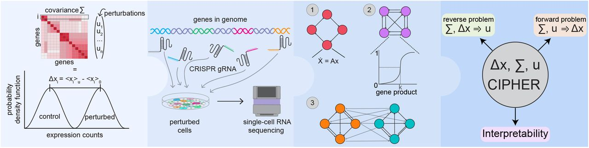

# CIPHER



**Covariance Inference for Perturbation and High-dimensional Expression Response**

CIPHER models the mean transcriptomic response to a perturbation as a linear
readout of the *control* gene–gene covariance. Writing the mean expression shift
of a perturbation as `delta_x`, CIPHER assumes

```
delta_x  ≈  Sigma @ u
```

where `Sigma` is the covariance estimated from unperturbed (control) cells and
`u` is a sparse driver vector. This single relation powers two complementary
tasks:

- **Forward** — given a *known* perturbation (a gene that was knocked
  down/out), predict its transcriptome-wide expression shift as a rank-1
  projection `dx ≈ a_hat · Sigma[:, g]`. The scalar `a_hat` is fit by least
  squares on a *train* set of genes and scored on a (optionally held-out) *test*
  set, reporting uncentered/centered R², Pearson, Spearman, cosine, MSE/RMSE/MAE
  and sign accuracy. Null covariances quantify the baseline expected from
  marginal statistics with the gene-gene covariance destroyed.
- **Reverse** — given only an observed shift `delta_x`, solve for `u` and rank
  genes by `|u|` to recover the perturbed gene (the *driver*). On Perturb-seq
  data, where the true target is known, this yields a rank / ROC-AUC per
  perturbation; on any control-vs-condition dataset it yields a ranked list of
  candidate driver genes.

Preprint: https://www.biorxiv.org/content/10.1101/2025.06.27.661814v1

## Installation

Install the package in editable mode from the repository root:

```bash
pip install -e .
```

The core install is lightweight (`numpy`, `scipy`, `pandas`, `anndata`, `h5py`,
`tqdm`). Optional extras add heavier, feature-specific dependencies:

```bash
pip install -e ".[plot]"    # matplotlib plotting helpers (cipher.plotting)
pip install -e ".[bayes]"   # PyMC horseshoe reverse (bayesian_reverse)
pip install -e ".[dev]"     # tests (pytest)
```

On the lab HPC the full conda environment (matching the exact versions used for
the paper) can be built from the pinned spec:

```bash
conda env create -f environment.yaml
```

## Quickstart (Python)

The public API is exposed at the top level of the `cipher` package. Each
application below takes a Perturb-seq `.h5ad` file and returns a result object —
**start here**. The six normalization modes are `raw`, `log1p`, `frequency`,
`libsize10k`, `log1CP10k`, and `pflog` (see `cipher.NORMALIZATION_MODES`). Driver
recovery (reverse prediction) defaults to the empirical-Bayes **posterior inverse**
(the most accurate, section 3); the linear solvers `matched_filter`, `pinv`,
`ridge`, and `lstsq` remain available as lightweight baselines. For large or
repeated analyses, precompute `Sigma` and the per-perturbation statistics to disk
once (section 5).

### 1. Forward prediction — predict a perturbation's shift (`ForwardResult`)

```python
import cipher

res = cipher.forward_prediction(
    "path/to/perturbseq.h5ad",
    normalization="log1p",
    nulls=("meanfield", "shuffled"),   # baseline covariance models
    holdout_frac=0.0,                  # 0.5 for out-of-sample gene holdout (paper setting)
    max_perturbations=None,            # int for a quick smoke test
)

res.results     # DataFrame per perturbation: r2_uncentered_real, r2_centered_real,
                # pearson_real, spearman_real, cosine_real, mse_real, sign_accuracy_real,
                # a_hat, n_train_genes, n_test_genes, r2_uncentered_<null>, ...
res.summary     # dict: mean_r2_uncentered_real, mean_pearson_real, mean_r2_uncentered_<null>, ...
res.save("path/to/output_dir")        # writes <dataset>_forward_<norm>.csv
```

You can also run forward metrics straight from a preprocessed directory
(real `Sigma` only, matching the paper's final forward recompute):
`cipher.forward_from_precomputed("path/to/output_dir", "log1p", holdout_frac=0.5)`.

### 2. Reverse prediction — recover the perturbed gene (`ReverseResult`)

```python
import cipher

res = cipher.reverse_prediction(
    "path/to/perturbseq.h5ad",
    normalization="log1p",
    method="posterior",   # posterior (default) | pip | matched_filter | pinv | ridge | lstsq
    top_k=10,
)

res.summary["mean_auc"]                 # mean one-vs-rest ROC-AUC of the true driver
res.summary["top10_accuracy"]           # fraction with the target gene in the top-k
res.results.sort_values("auc").head()   # per-perturbation ranks / AUC
res.save("path/to/output_dir")          # writes <dataset>_reverse_<norm>_<method>.csv
```

The default `posterior` method is the fullH_diag empirical-Bayes inverse (the most
accurate, section 3); `matched_filter`/`pinv`/`ridge`/`lstsq` are lightweight
linear baselines. For the pooled ROC / precision-recall curves of the posterior,
use `cipher.posterior_inverse_prediction` (section 3) directly.
`cipher.reverse_from_precomputed(...)` runs the same from a preprocessed
directory. With the `[bayes]` extra, `cipher.bayesian_reverse(Sigma, delta_x)`
fits a horseshoe prior and returns posterior inclusion probabilities.

### 3. Posterior inverse — strongest driver recovery (`InverseResult`)

The strongest inverse solver is the **fullH_diag posterior**: it whitens `dx` by
its per-perturbation sampling covariance (`lambda/n0 + projected_var/nu`), fits a
prior variance by empirical Bayes, and scores each gene by its posterior
perturbation strength (or a single-effect PIP), scored with pooled ROC /
precision-recall curves.

```python
import cipher

# End-to-end from an .h5ad (moderate datasets):
res = cipher.posterior_inverse_prediction(
    "path/to/perturbseq.h5ad",
    normalization="log1CP10k",
    method="posterior",         # "posterior" (default) or "pip"
)
res.summary["pooled_auc"]                 # pooled one-vs-rest ROC-AUC
res.summary["mean_per_pert_auc"]          # mean over perturbations
res.summary["pooled_average_precision"]   # pooled AP (precision-recall)
res.roc, res.prc                          # (fpr, tpr), (precision, recall) for plotting

# For large datasets, precompute once (section 5) then run from disk:
res = cipher.posterior_inverse_from_precomputed("path/to/output_dir", "log1CP10k",
                                                method="posterior")
```

To reproduce the paper's per-dataset **CRISPRi vs CRISPRa** ROC/PR figure, run the
inverse for each dataset, group with `cipher.dataset_group(name)`, and draw each
group with `cipher.plotting.plot_inverse_group` (thin per-dataset traces + a mean
trace):

```python
import matplotlib.pyplot as plt
from cipher import plotting

results = {"CRISPRi": [...], "CRISPRa": [...]}   # InverseResult per dataset, by group
fig, axes = plt.subplots(1, 2, figsize=(12, 6))
plotting.plot_inverse_group(results["CRISPRi"], curve="roc", ax=axes[0], color="#d62728")
plotting.plot_inverse_group(results["CRISPRa"], curve="roc", ax=axes[1], color="#1f77b4")
```

### 4. Condition drivers — control vs condition (`DriverResult`)

The reverse problem applied outside Perturb-seq: given a control group and a
condition group, rank the genes most likely to *drive* the condition. There is
no ground-truth label, so the output is a ranked candidate list.

```python
import cipher

# From an .h5ad / AnnData with a grouping column in obs:
res = cipher.condition_drivers(
    "path/to/dataset.h5ad",
    condition_key="stim",       # obs column grouping the cells
    control_value="rest",       # value marking control cells
    condition_value="stim",     # None => every non-control cell
    normalization="log1p",
    method="matched_filter",    # default; also "posterior"/"pip" (fullH_diag inverse), "pinv"/"ridge"
)
res.top(20)                     # top-ranked candidate driver genes
res.save("path/to/output_dir") # writes <name>_drivers_<norm>_<method>.csv

# Or directly from two raw (cells x genes) matrices sharing a gene axis:
res = cipher.condition_drivers_from_matrices(
    control_X, condition_X, gene_names,
    normalization="log1p",
    method="matched_filter",
)
```

### 5. Precompute Σ + statistics to disk (for large or repeated analyses)

Every application above recomputes the covariance from the `.h5ad` each call.
For large datasets or repeated runs, `preprocess_dataset` estimates `Sigma` and
the per-perturbation statistics for one or more normalizations and writes them to
a directory **once**; each application then has a fast `*_from_precomputed`
variant (`forward_from_precomputed`, `reverse_from_precomputed`,
`posterior_inverse_from_precomputed`). `load_precomputed` reads one mode back as a
lightweight, memory-mappable object.

```python
import cipher

cfg = cipher.PreprocessConfig(
    expression_threshold=1.0,
    min_samples_per_pert=100,
    cov_max_cells=10000,
)
outdir = cipher.preprocess_dataset(
    "path/to/perturbseq.h5ad",
    "path/to/output_dir",
    modes=["log1p", "log1CP10k"],   # None => all six modes
    config=cfg,
    overwrite=False,
)

pc = cipher.load_precomputed("path/to/output_dir", mode="log1p")
Sigma = pc.sigma(mmap=True)          # (p, p) covariance, memory-mapped
dx = pc.dx                           # (n_perts, p) mean shifts
print(cipher.list_modes("path/to/output_dir"))
```

### Lower-level `Dataset`

For custom pipelines, `load_dataset` returns a `Dataset` that handles
perturbation detection, target-gene mapping, and control/perturbation matrices.

```python
import cipher

ds = cipher.load_dataset(
    "path/to/perturbseq.h5ad",
    expression_threshold=1.0,
    min_samples=100,
)
ds.n_genes, ds.n_perturbations
ds.gene_names                       # np.array[str], length p
ds.perturbations                    # list[str], non-control perturbation labels
ds.target_gene_indices              # int64 array parallel to perturbations (-1 if absent)

control = ds.control_matrix(dense=True)          # (n_control, p)
pert = ds.perturbation_matrix(ds.perturbations[0], dense=True)
g = ds.gene_index("GATA1")

# Estimate the control covariance and run one perturbation forward by hand:
Sigma = cipher.compute_covariance(cipher.normalize_matrix(control, "log1p"))
```

## Command-line usage

Installing the package registers a `cipher` console script with four
subcommands. Each takes an input `.h5ad` and an output directory (`-o`).

```bash
# Forward prediction (transcriptomic shift) against null covariances.
cipher forward path/to/perturbseq.h5ad -o out/ --normalization log1p \
    --nulls meanfield shuffled

# Reverse prediction (recover the perturbed gene).
cipher reverse path/to/perturbseq.h5ad -o out/ --normalization log1p \
    --method matched_filter --top-k 10

# Condition-driver prediction (control vs condition, no ground truth).
cipher driver path/to/dataset.h5ad -o out/ \
    --condition-key stim --control rest --condition stim \
    --method matched_filter --top 25

# Precompute Sigma + per-perturbation stats for chosen modes (for scale/reuse).
cipher preprocess path/to/perturbseq.h5ad -o out/ --modes log1p log1CP10k
```

Run `cipher --version` or `cipher <command> --help` for all options.

## Data / source datasets

**Source data (Google Drive):**
Will be uploaded to zenodo.

## Reproducing paper figures

Notebooks to reproduce each figure of the paper live in the `notebooks/`
directory and run against the (still-included) `src/` implementation used for
the publication. All notebooks work with the supplied conda environment.

| Notebook | Figures |
| --- | --- |
| `notebooks/LR_fig2.ipynb` | Fig. 2 (All) |
| `notebooks/LR_fig3_R2_hist.ipynb` | Fig. 3 (A–M) |
| `notebooks/LF_double_pert_R2_and_inference.ipynb` | Fig. 3 (N, O, P); Fig. 4 H |
| `notebooks/LR_fig3_cross_dataset.ipynb` | Fig. 3 (Q, R) |
| `notebooks/LR_fig4.ipynb` | Fig. 4 (A–G) |
| `notebooks/LR_fig5_TRADE_and_EGENES.ipynb` | Fig. 5 |

**Method benchmarks** comparing CIPHER against other approaches are in the
`benchmarks/` folder.

## Preprint

Kuznets-Speck, B., Schwartz, L., Sun, H., Melzer, M. E., Kumari, N., Haley, B.,
Prashnani, E., Vaikuntanathan, S., & Goyal, Y. (2025). *Fluctuation structure
predicts genome-wide perturbation outcomes.* bioRxiv.
https://www.biorxiv.org/content/10.1101/2025.06.27.661814v1

## License

[MIT License](LICENSE)
